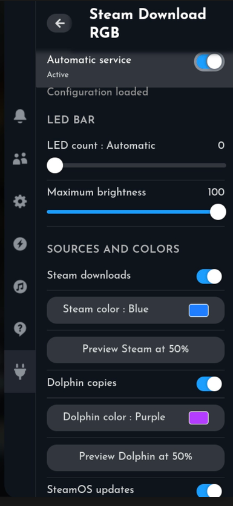
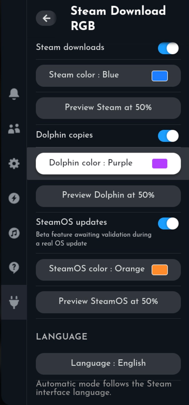

# BC250 — LED Progress

Animated ARGB progress bar for **Steam downloads**, **Dolphin/KIO file transfers**, and **SteamOS updates** on SteamOS, using **OpenLinkHub**, its integrated OpenRGB server, and a **Corsair COMMANDER DUO**.

## Current paired beta release

This update contains two matching components:

- **Complete bundle:** [`steam-download-rgb-v0.8-beta9-bundle.zip`](./steam-download-rgb-v0.8-beta9-bundle.zip)

The main service works without Decky Loader. The Decky plugin only provides a convenient settings panel inside SteamOS Gaming Mode.

> **Beta note:** Steam and Dolphin monitoring preserve the behavior validated in v0.7.1. SteamOS update monitoring is passive and read-only, but its complete LED sequence still needs wider validation during real SteamOS updates and across different update channels.

## What the LED bar displays

Display priority is fixed:

1. **SteamOS update** — orange by default;
2. **Steam download** — blue by default;
3. **Dolphin/KIO file copy** — purple by default;
4. **No active task** — OpenLinkHub regains control and restores the normal RGB profile, such as `gpu-temperature`.

## Main features

- Real Steam download progress from Steam's currently active phase;
- Dolphin/KIO copy progress through `org.kde.JobViewServer`;
- multiple Dolphin copies weighted by their total byte size;
- passive SteamOS update progress monitoring through Atomupd;
- fixed priority: SteamOS > Steam > Dolphin;
- configurable OpenRGB progress zone;
- configurable LED count;
- automatic LED-count detection when the value is `0`;
- configurable maximum brightness;
- separate enable switches and colors for Steam, Dolphin, and SteamOS;
- smooth partial-LED brightness between full LED steps;
- automatic restoration of the original OpenLinkHub profiles;
- diagnostic, monitor-only, LED-test, preview, and emergency-restore modes;
- optional bilingual Decky Loader panel.

## Decky Loader panel

The optional Decky plugin provides:

- current user-service status;
- automatic-service enable/disable control;
- automatic or manual LED-count selection;
- maximum-brightness adjustment;
- separate Steam, Dolphin, and SteamOS switches;
- source-specific color presets;
- 50% preview buttons for each source;
- safe settings saving and automatic service restart;
- interface language selection:
  - **Automatic**;
  - **Français**;
  - **English**.

Automatic language mode uses French when Steam is detected in French. English is used for other Steam interface languages.

<p align="center">
  
  
</p>

## Requirements

- SteamOS;
- Python 3;
- OpenLinkHub controlling a Corsair COMMANDER DUO;
- OpenLinkHub's integrated OpenRGB target server enabled on port `6743`;
- Decky Loader only when using the optional Gaming Mode settings plugin.

SteamOS read-only mode does **not** need to be disabled.

---

# Installation tutorial

## 1. Enable the OpenRGB server in OpenLinkHub

The main OpenLinkHub configuration must contain:

```json
{
  "enableOpenRGBTargetServer": true,
  "openRGBPort": 6743
}
```

The configuration location depends on the OpenLinkHub installation. Search for it without changing anything:

```bash
grep -R '"enableOpenRGBTargetServer"\|"openRGBPort"' \
  ~/OpenLinkHub ~/.config/OpenLinkHub 2>/dev/null
```

After editing the configuration, restart OpenLinkHub using the method or service used by your installation.

Verify that port `6743` is listening:

```bash
ss -ltn | grep ':6743'
```

The command must display a listening socket on port `6743`.

Steam Download RGB enables and disables the COMMANDER DUO OpenRGB integration automatically while it controls the progress bar. Do not leave the integration manually forced during the initial test sequence.

## 2. Install or update the main service

Download:

```text
steam-download-rgb-v0.8-beta2.zip
```

Open a terminal in the folder containing the archive, then run:

```bash
unzip -o steam-download-rgb-v0.8-beta2.zip
cd steam-download-rgb
chmod +x install.sh uninstall.sh run-tests.sh
./install.sh
```

Everything is installed inside the user's home directory:

```text
Application: ~/.local/share/steam-download-rgb
Configuration: ~/.config/steam-download-rgb/config.json
User service: ~/.config/systemd/user/steam-download-rgb.service
```

When updating an existing installation, the installer:

- preserves the existing configuration;
- adds missing v0.8 settings;
- removes only the obsolete `reverse` key;
- creates this one-time backup:

```text
~/.config/steam-download-rgb/config.json.backup-before-v0.8-beta2
```

If the service was already active before installation, the installer restarts it automatically.

## 3. Stop the automatic service before manual tests

This prevents two instances from controlling the LED bar at the same time:

```bash
systemctl --user stop steam-download-rgb.service
```

## 4. Run the passive diagnostic

This checks Steam CEF, OpenLinkHub, the COMMANDER DUO, stored RGB profiles, and the OpenRGB server without changing the LEDs:

```bash
~/.local/share/steam-download-rgb/.venv/bin/python \
  ~/.local/share/steam-download-rgb/steam_download_rgb.py --diagnose
```

A successful result should end with messages indicating that Steam CEF, OpenLinkHub, and the OpenRGB server are available.

## 5. Monitor Steam, Dolphin, and SteamOS without changing the LEDs

```bash
~/.local/share/steam-download-rgb/.venv/bin/python \
  ~/.local/share/steam-download-rgb/steam_download_rgb.py --monitor-only
```

Start a Steam download or a file copy from Dolphin. The terminal should display the detected source and its progress.

Stop the test with:

```text
Ctrl+C
```

Steam may split one download into several internal phases. A value can therefore approach 100%, return to 0%, and start a new phase. The program displays the real progress published by Steam and does not invent a global percentage across unknown phases.

## 6. Run the progressive LED test

This displays `0 → 25 → 50 → 75 → 100%`, then restores the original OpenLinkHub profiles automatically:

```bash
~/.local/share/steam-download-rgb/.venv/bin/python \
  ~/.local/share/steam-download-rgb/steam_download_rgb.py --led-test
```

## 7. Run a real manual test

```bash
~/.local/share/steam-download-rgb/.venv/bin/python \
  ~/.local/share/steam-download-rgb/steam_download_rgb.py
```

Expected behavior:

1. With no activity, OpenLinkHub keeps the normal profile, such as `gpu-temperature`.
2. A Dolphin copy starts: the progress bar fills in purple.
3. A Steam download starts: Steam takes priority and the bar turns blue.
4. A SteamOS update takes priority over both Steam and Dolphin and uses orange.
5. When the highest-priority source ends, the next active source becomes visible again.
6. Two seconds after all activity stops, OpenRGB integration is disabled and OpenLinkHub restores the stored profiles.

Stop the manual test with `Ctrl+C`.

## 8. Enable automatic startup

Only enable the service after the diagnostic and LED tests succeed:

```bash
systemctl --user enable --now steam-download-rgb.service
```

Check its status:

```bash
systemctl --user status steam-download-rgb.service
```

Follow its logs:

```bash
journalctl --user -u steam-download-rgb.service -f
```

Stop and disable automatic startup:

```bash
systemctl --user disable --now steam-download-rgb.service
```

---

# Optional Decky Loader plugin tutorial

## 1. Requirements for the Decky plugin

Before installing the plugin, make sure that:

- the main Steam Download RGB v0.8 service is installed;
- the main service has passed the diagnostic and LED tests;
- Decky Loader is installed;
- OpenLinkHub and its integrated OpenRGB server are already configured.

## 2. Install the Decky plugin from ZIP

<p align="center">
  
  
</p>

Download:

```text
steam-download-rgb-decky-v0.8-beta9.zip
```

Then:

1. Open Decky Loader settings.
2. Remove an older **Steam Download RGB** Decky beta when one is already installed.
3. Enable **Developer Mode**.
4. Open **Developer → Install Plugin from ZIP**.
5. Select `steam-download-rgb-decky-v0.8-beta9.zip`.
6. Confirm the installation.

If the Steam Download RGB panel does not appear immediately, switch to Desktop Mode and restart Decky Loader:

```bash
sudo systemctl restart plugin_loader.service
```

Return to Gaming Mode and open Decky Loader again.

Beta 9 includes a clean-environment fix so `systemctl --user` does not accidentally load Decky's bundled OpenSSL libraries.

## 3. Use the Decky panel

1. Open the SteamOS Quick Access menu.
2. Open Decky Loader.
3. Select **Steam Download RGB**.
4. Use **Automatic service** to enable or disable automatic startup.
5. Configure **LED count**:
   - `0` = automatic detection of all LEDs in the selected progress zone;
   - any positive value = manually limit the number of progress LEDs.
6. Adjust **Maximum brightness**.
7. Enable or disable the desired sources:
   - Steam downloads;
   - Dolphin copies;
   - SteamOS updates.
8. Select a color preset for each source.
9. Use a preview button to display that source at 50% for two seconds.
10. Select the interface language:
    - Automatic;
    - Français;
    - English.
11. Press **Save settings** to apply the configuration and restart the service safely.

SteamOS update monitoring is currently a beta feature awaiting wider validation during real operating-system updates.

## 4. Update the Decky plugin

To install a newer beta:

1. Download the new Decky plugin ZIP.
2. Remove the currently installed **Steam Download RGB** plugin from Decky Loader.
3. Keep Developer Mode enabled.
4. Select **Developer → Install Plugin from ZIP**.
5. Select the new archive.
6. Restart Decky Loader if the updated panel does not appear immediately:

```bash
sudo systemctl restart plugin_loader.service
```

---

# Manual configuration

The configuration file is:

```text
~/.config/steam-download-rgb/config.json
```

Open it with:

```bash
nano ~/.config/steam-download-rgb/config.json
```

Default v0.8 configuration:

```json
{
  "steam_cef_targets_url": "http://127.0.0.1:8080/json",
  "openlinkhub_url": "http://127.0.0.1:27003",
  "commander_serial": "",
  "commander_name_contains": "COMMANDER DUO",
  "openrgb_host": "127.0.0.1",
  "openrgb_port": 6743,
  "openrgb_device_name_contains": "COMMANDER DUO",
  "zones": [
    0,
    1
  ],
  "progress_zone": 1,
  "progress_led_count": 0,
  "max_brightness_percent": 100,
  "poll_interval_seconds": 0.5,
  "idle_restore_delay_seconds": 2.0,
  "reconnect_delay_seconds": 2.0,
  "request_timeout_seconds": 4.0,
  "filled_color": [
    28,
    125,
    255
  ],
  "copy_filled_color": [
    180,
    60,
    255
  ],
  "steamos_update_color": [
    255,
    140,
    40
  ],
  "empty_color": [
    0,
    0,
    0
  ],
  "minimum_one_led_when_active": true,
  "smooth_partial_led": true,
  "monitor_steam_downloads": true,
  "monitor_dolphin_copies": true,
  "monitor_steamos_updates": true,
  "restore_on_startup": true,
  "monitor_only": false
}
```

## Important settings

### OpenRGB zones

```json
"zones": [0, 1]
```

The current OpenLinkHub OpenRGB implementation requires global LED writes. All LED zones belonging to the COMMANDER DUO must therefore remain listed, even when only one zone displays progress.

### Progress zone

```json
"progress_zone": 1
```

This is the OpenRGB zone that displays progress. With a COMMANDER DUO exposing `ARGB Channel 1` and `ARGB Channel 2`, the second channel is generally zone `1`.

### LED count

```json
"progress_led_count": 0
```

- `0`: automatically use every LED in the selected progress zone;
- a positive value: use only that number of LEDs;
- a value higher than the physical LED count is automatically limited.

### Maximum brightness

```json
"max_brightness_percent": 100
```

This limits only colors sent by Steam Download RGB. It does not modify OpenLinkHub's normal idle profiles.

### Source switches

```json
"monitor_steam_downloads": true,
"monitor_dolphin_copies": true,
"monitor_steamos_updates": true
```

Each source can be enabled or disabled independently.

### Colors

Each color is an RGB array in the form `[red, green, blue]`, with values from `0` to `255`:

```json
"filled_color": [28, 125, 255],
"copy_filled_color": [180, 60, 255],
"steamos_update_color": [255, 140, 40],
"empty_color": [0, 0, 0]
```

### Return delay

```json
"idle_restore_delay_seconds": 2.0
```

This is the delay before OpenLinkHub regains control after activity stops.

After editing the configuration manually, restart the service:

```bash
systemctl --user restart steam-download-rgb.service
```

---

# Preview commands

Display Steam at 50% for two seconds:

```bash
~/.local/share/steam-download-rgb/.venv/bin/python \
  ~/.local/share/steam-download-rgb/steam_download_rgb.py \
  --preview-source steam \
  --preview-progress 50 \
  --preview-seconds 2
```

Display Dolphin at 50%:

```bash
~/.local/share/steam-download-rgb/.venv/bin/python \
  ~/.local/share/steam-download-rgb/steam_download_rgb.py \
  --preview-source dolphin \
  --preview-progress 50 \
  --preview-seconds 2
```

Display SteamOS at 50%:

```bash
~/.local/share/steam-download-rgb/.venv/bin/python \
  ~/.local/share/steam-download-rgb/steam_download_rgb.py \
  --preview-source steamos \
  --preview-progress 50 \
  --preview-seconds 2
```

Each preview restores the OpenLinkHub profiles automatically.

---

# Emergency restoration

Immediately return RGB control to OpenLinkHub and reapply the stored profiles:

```bash
~/.local/share/steam-download-rgb/.venv/bin/python \
  ~/.local/share/steam-download-rgb/steam_download_rgb.py --restore
```

---

# Update procedure

## Update the main service

```bash
unzip -o steam-download-rgb-v0.8-beta2.zip
cd steam-download-rgb
chmod +x install.sh uninstall.sh run-tests.sh
./install.sh
```

The installer preserves the configuration, adds missing settings, removes only the obsolete direction key, and restarts the service when it was already active.

## Update the Decky plugin

Remove the old Steam Download RGB plugin from Decky Loader, then install the new ZIP through **Developer → Install Plugin from ZIP**.

---

# Uninstallation

From the extracted `steam-download-rgb` folder:

```bash
chmod +x uninstall.sh
./uninstall.sh
```

The uninstaller:

- stops and disables the user service;
- removes the installed application files;
- removes the systemd user-service file;
- keeps the configuration in:

```text
~/.config/steam-download-rgb
```

To delete the saved configuration as well:

```bash
rm -rf ~/.config/steam-download-rgb
```

Remove the optional Decky plugin separately from Decky Loader.

---

# Troubleshooting

## Port 6743 is not listening

Check that OpenLinkHub contains:

```json
{
  "enableOpenRGBTargetServer": true,
  "openRGBPort": 6743
}
```

Restart OpenLinkHub, then run:

```bash
ss -ltn | grep ':6743'
```

## The service does not start

```bash
systemctl --user status steam-download-rgb.service
journalctl --user -u steam-download-rgb.service -n 100 --no-pager
```

## The Decky panel does not appear

```bash
sudo systemctl restart plugin_loader.service
```

Then return to Gaming Mode and reopen Decky Loader.

## The LEDs remain under OpenRGB control

Run the emergency restoration command:

```bash
~/.local/share/steam-download-rgb/.venv/bin/python \
  ~/.local/share/steam-download-rgb/steam_download_rgb.py --restore
```

## Dolphin copies are not detected

Only jobs published through KDE's `org.kde.JobViewServer` are visible. Copies started from Dolphin are supported; plain `cp` or `rsync` commands may not be published through this interface.

---

# How each source is monitored

## Steam

The program connects to the Steam client's `SharedJSContext` through CEF/CDP and reads the information published by `DownloadOverview` and `DownloadItems`.

Steam's internal JavaScript interfaces are not a stable public API. A future Steam client update may require an adaptation.

## Dolphin

Dolphin/KIO copy jobs are read from the KDE session bus through `org.kde.JobViewServer` and `org.kde.JobViewV3`.

When multiple copies are active, their overall progress is weighted according to their total byte size.

## SteamOS

SteamOS update progress is read passively from Atomupd:

```text
Service: com.steampowered.Atomupd1
Object: /com/steampowered/Atomupd1
Properties: UpdateStatus and ProgressPercentage
```

The program never starts, pauses, resumes, or cancels a SteamOS update.

---

# Safety

- Fans, pumps, temperatures, and power settings are never modified.
- SteamOS update monitoring is read-only.
- Current OpenLinkHub RGB profiles are recorded before control is taken.
- Normal exit, `Ctrl+C`, errors, and `SIGTERM` return control to OpenLinkHub.
- The systemd service is not enabled automatically during a first installation.
- Configuration migration is non-destructive except for removal of the obsolete `reverse` key.
- Decky settings writes are atomic and use restrictive file permissions.
- Public archives contain no personal serial number, password, or token.

---

# Checks performed

- Python compilation;
- Bash syntax validation;
- systemd unit verification;
- 28 automated tests and simulations;
- progress-zone, LED-count, brightness, and partial-LED tests;
- Steam, Dolphin, and Atomupd parsing tests;
- profile-restoration tests after errors;
- migration test from an old configuration containing `reverse: true`;
- scan for personal data in public archives.

No software can be guaranteed to be completely bug-free. A first installation should follow this sequence:

```text
Diagnostic → monitor-only → LED test → real manual test → automatic service
```

---

# AI-assisted development

This project was developed with assistance from ChatGPT by OpenAI, based on descriptions, real SteamOS tests, and user feedback.

The features were progressively tested and corrected with:

- Steam CEF;
- KDE JobViewServer;
- SteamOS Atomupd;
- OpenLinkHub;
- OpenRGB;
- Decky Loader;
- the Corsair COMMANDER DUO.

This note is included for transparency about how the project was created.

## License

Distributed under the [MIT License](./LICENSE).
